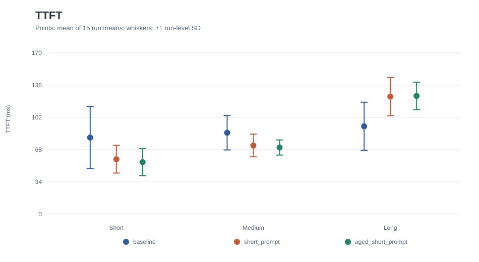
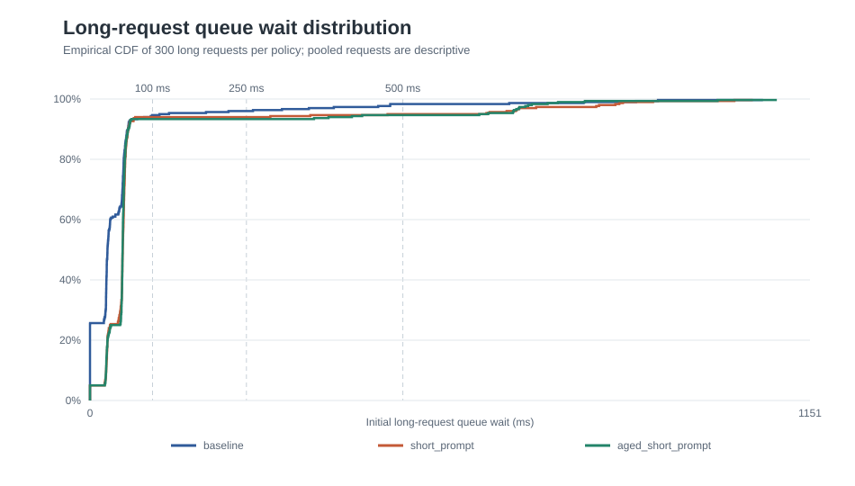

# Scheduling lab v1 — AI Infrastructure / ML Systems case study

**Purpose:** Measure how choosing the next waiting LLM request redistributes first-token latency across mixed prompt lengths on one GPU. This project extends [pinned nano-vLLM](../artifacts/environment/upstream-commit.txt); it does not replace the upstream model runner, attention kernels, KV-cache manager, chunked prefill, sampling, or decode path.

| Policies | Formal GPU runs | Completed measured requests | Paired comparison blocks | Final CPU tests |
| ---: | ---: | ---: | ---: | ---: |
| **3** | **45/45** | **2,700/2,700** | **15** | **71/71** |

The main result has a cost on both sides: `short_prompt` moved short-request mean TTFT from **80.8 to 57.9 ms**, while long-request mean TTFT moved from **92.6 to 124.0 ms**. Throughput stayed close across policies. These are workload-specific latency-allocation results, not a claim that the GPU or model executes faster. Sources: [class-level measurements](../artifacts/analysis/formal-v1/class-summary.csv), [analysis](../artifacts/analysis/formal-v1/report.md), [formal validation](../artifacts/formal-benchmark/validation.json), [release audit](v1-release-summary.md).

## The problem and the system boundary

Upstream nano-vLLM first considers the head of its waiting deque for prefill. Fresh arrivals enter at the tail; incomplete prefills keep their place, and preempted running requests return to the front. That makes the baseline more specific than simple arrival-order FIFO. A shortest-prompt policy could advance small requests, but it can also defer long ones. The experiment asks how much that choice changes observed latency and long-request waiting under a fixed mixed-length trace. [Architecture analysis](architecture.md) · [Scheduler source](../nanovllm/engine/scheduler.py)

```text
Frozen JSONL trace
    -> timed producer -> thread-safe admission queue
    -> coordinator thread (sole LLMEngine owner)
    -> Scheduler.waiting candidate choice
    -> upstream prefill, KV-cache allocation, running/decode, sampling
    -> lifecycle/token telemetry + replay release timestamps
    -> per-request records -> paired offline analysis
```

The policy boundary is narrow: it chooses one current waiting index before the existing allocation and token-budget checks. It does not scan for a feasible alternative after a selected candidate fails a resource check. Running/decode order and preemption stay in the upstream scheduler path. This limits the implementation change while leaving real interactions with cache state and GPU execution in the measured system. [Policy design](scheduling-policy-design.md) · [Architecture analysis](architecture.md)

## What I built

| Component | Concrete work | Evidence |
| --- | --- | --- |
| Workload inputs | Deterministic development and formal trace generation, sidecar metadata, tokenizer-verified prompt lengths, and package validation. | [Trace generator](../scripts/make_trace.py), [formal trace generator](../scripts/make_formal_trace.py), [frozen workloads](../workloads) |
| Arrival replay | A producer thread releases requests at monotonic targets; an admission queue separates releases from the coordinator that alone calls `LLMEngine`. | [CPU replay](../scripts/replay_trace.py), [engine replay](../scripts/run_replay.py) |
| Telemetry | Opt-in engine/scheduler hooks record admission, first scheduling, prefill dispatch, token times, and completion; replay joins them to external IDs and release times. | [Telemetry collector](../nanovllm/telemetry.py), [engine hooks](../nanovllm/engine/llm_engine.py), [metric contract](telemetry-spec.md) |
| Scheduling | A CPU-testable selector, validated configuration, and scheduler-owned first-enqueue timestamps for the aged policy. | [Selector](../nanovllm/engine/waiting_policy.py), [scheduler](../nanovllm/engine/scheduler.py), [configuration](../nanovllm/config.py) |
| Experiment and analysis | Frozen run order, fresh-process execution, progress/metadata retention, aggregation, paired analysis, sensitivity check, and figures. | [Orchestrator](../scripts/formal_benchmark.py), [aggregate](../scripts/aggregate_formal.py), [analysis code](../artifacts/analysis/formal-v1/analyze.py) |

The repository also contains [CPU regression tests](../tests) for trace/replay integrity, telemetry, scheduling invariants, and orchestration. The final release audit reports **71/71 passing CPU tests**. [Release audit](../PROJECT_STATE.md)

## Scheduling policies

| Policy | Waiting-request decision | Key boundary |
| --- | --- | --- |
| `baseline` | Select current deque head. | Default, preserves upstream queue semantics. |
| `short_prompt` | Select smallest immutable original prompt-token count. | Stable ties follow current deque order. |
| `aged_short_prompt` | Minimize `prompt_tokens − 320 × age_seconds`. | Age begins at first scheduler enqueue and survives preemption/requeue. |

Both candidate policies scan the waiting deque in **O(n)** time for `n` waiting requests; successful non-head deque deletion is also **O(n)**. The aged policy compares an exact integer nanosecond-scaled score and uses scheduler-owned timestamps, independent of measurement telemetry. Its age can include running time before later preemption, so it is not the same as initial queue-wait telemetry. No scheduling decision uses future output length. [Waiting-policy design](scheduling-policy-design.md) · [Aging design](aging-policy-design.md) · [selector source](../nanovllm/engine/waiting_policy.py)

## How the comparison was frozen

The [formal-mixed-v1 protocol](benchmark-protocol.md) specifies three seeded, immutable traces with **60 requests each** and **20 prompts per short/medium/long class**. Prompt lengths are exactly **32/96/192 tokens**. The same seed-specific trace is used for all policies and repetitions. The matrix is **3 policies × 3 seeds × 5 repetitions = 45 runs**, ordered in **15** matched `(seed, repetition)` blocks with rotated policy positions. All **2,700** measured requests completed. Sources: [formal manifest](../artifacts/formal-benchmark/manifest.json), [validation record](../artifacts/formal-benchmark/validation.json), [frozen protocol](benchmark-protocol.md).

Measurements used pinned Qwen3-0.6B on a single RTX 4050 Laptop GPU with the same engine/generation configuration across policies. Each run used a fresh process/engine and excluded its telemetry-disabled warm-up. User-visible TTFT and E2E start at **actual replay release**, while initial queue wait starts at engine admission. Paired differences are calculated from run-level summaries; the thousands of requests are not treated as independent experimental repetitions. [Protocol](benchmark-protocol.md) · [reproduction guide](reproduce-v1.md) · [run metadata](../artifacts/formal-benchmark/manifest.json)

## What changed for short, medium, and long prompts

Values below are **means of 15 run-level class means**, in milliseconds. Each cell comes from [class-summary.csv](../artifacts/analysis/formal-v1/class-summary.csv); the exact paired changes come from [paired-results.csv](../artifacts/analysis/formal-v1/paired-results.csv).

| Prompt class | Baseline TTFT | `short_prompt` TTFT | `aged_short_prompt` TTFT | `short_prompt − baseline` paired mean |
| --- | ---: | ---: | ---: | ---: |
| Short | 80.768 | 57.921 | 54.809 | −22.848 |
| Medium | 85.901 | 72.412 | 70.304 | −13.489 |
| Long | 92.625 | 123.995 | 124.683 | +31.370 |



The first-token gain for short requests coincided with a long-request cost: mean paired long initial queue wait rose **31.937 ms** with `short_prompt` and **32.924 ms** with `aged_short_prompt` versus baseline. All long requests completed, and none crossed the frozen **10,000 ms** near-starvation threshold. The pooled long-request queue-wait p95 was **111.046 / 475.568 / 622.061 ms** for baseline / `short_prompt` / `aged_short_prompt`; those pooled tails describe requests and are not independent run-level trials. [Paired results](../artifacts/analysis/formal-v1/paired-results.csv) · [fairness analysis](../artifacts/analysis/formal-v1/analysis-summary.json)



## Throughput, aging, and limits

Mean full-run throughput was **2.827 / 2.854 / 2.826 completed requests/s** for baseline / `short_prompt` / `aged_short_prompt`. Mean paired changes were small and mixed in direction across blocks; the frozen study does not establish a material throughput advantage. This is a study of **latency allocation and fairness**, not raw GPU speed. [Analysis summary](../artifacts/analysis/formal-v1/analysis-summary.json) · [analysis report](../artifacts/analysis/formal-v1/report.md)

`aged_short_prompt` and `short_prompt` produced the same **observable first-selection order in all 15 paired blocks**. The formal trace did not create a large enough observed admission-time proxy gap to exercise the intended age crossover at initial selection. Internal candidate sets and first-enqueue decision traces were not logged, so identical first-selection order does not prove every scheduler decision matched. The result does not show that aging is ineffective under other arrival patterns. [Aging analysis](../artifacts/analysis/formal-v1/report.md) · [analysis JSON](../artifacts/analysis/formal-v1/analysis-summary.json)

One baseline run has a large UTC-versus-monotonic timing discrepancy. It remains in the primary dataset; the documented sensitivity analysis removes the **whole paired block** and still shows the short-versus-long initial-wait trade-off, while the sign of the small overall E2E mean difference changes. Its cause is not established. The study is limited to one model, one GPU, one offered-load profile, and three trace seeds. [Anomaly analysis](../artifacts/analysis/formal-v1/anomaly-analysis.md) · [v1 report](v1-report.md)

## Reproduce and inspect

Start with the [reproduction guide](reproduce-v1.md). The archived [manifest](../artifacts/formal-benchmark/manifest.json), [raw run packages](../artifacts/formal-benchmark/runs), [aggregate](../artifacts/formal-benchmark/summary.json), [analysis tables](../artifacts/analysis/formal-v1/analysis-summary.json), and [figures](../artifacts/analysis/formal-v1/figures) can be inspected without a GPU rerun. The guide explains the pinned environment, trace hashes, archived dry-run, and how to direct any independent measurement to a separate output root.

The annotated Git tag `scheduling-lab-v1` identifies the release state. Archived formal runs executed source commit `f582364e1248a3b1f9ec241c07c4895eac75783f`, recorded in [preflight metadata](../artifacts/formal-benchmark/preflight.json); later release documentation did not change the measured scheduler. [Release audit](v1-release-summary.md)

For technical review: [architecture](architecture.md) · [policy design](scheduling-policy-design.md) · [aging design](aging-policy-design.md) · [benchmark protocol](benchmark-protocol.md) · [detailed v1 report](v1-report.md) · [release summary](v1-release-summary.md).

## Upstream attribution

This project extends [GeeeekExplorer/nano-vllm](https://github.com/GeeeekExplorer/nano-vllm) at the revision recorded in [upstream-commit.txt](../artifacts/environment/upstream-commit.txt). Upstream supplies the inference engine, model execution, attention kernels, KV-cache manager, chunked prefill, sampling, and CUDA execution. The waiting-candidate policies, replay/telemetry infrastructure, formal workload and experiment tooling, tests, and analysis are the scheduling-lab additions. The retained upstream quick start and separate RTX 4070 benchmark appear in the [README's upstream section](../README.md#upstream-nano-vllm-reference); those benchmark numbers are not scheduling-lab results.
