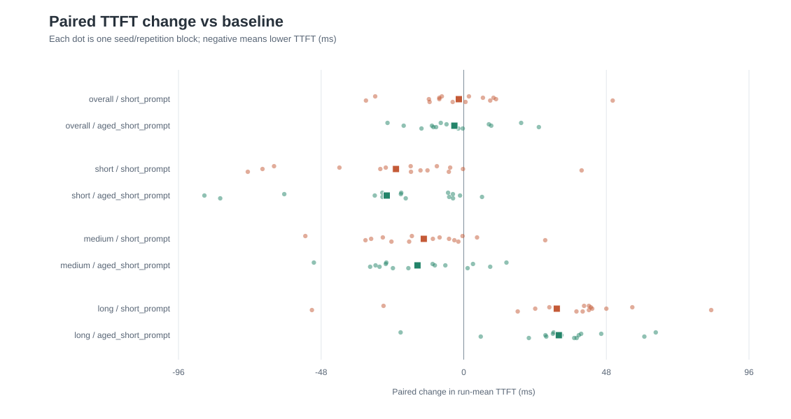

# Scheduling lab v1: mixed-length request scheduling on nano-vLLM

This report packages the completed **formal-mixed-v1** experiment. It is a
student study built on [GeeeekExplorer/nano-vllm](https://github.com/GeeeekExplorer/nano-vllm),
not an upstream nano-vLLM benchmark. The pinned upstream revision is in
[upstream-commit.txt](../artifacts/environment/upstream-commit.txt). The
[frozen protocol](benchmark-protocol.md), [formal manifest](../artifacts/formal-benchmark/manifest.json),
and [offline analysis](../artifacts/analysis/formal-v1/report.md) are the
source records for the results below. Commands and artifact layout are in the
[reproduction guide](reproduce-v1.md).

## 1. Motivation

A request scheduler can make a short prompt start sooner by selecting it ahead
of a longer prompt, but that choice may increase the longer request's wait.
This study isolates the waiting-candidate rule on a small, readable inference
engine and measures the latency/fairness trade-off on one frozen mixed-length
workload. It compares `baseline`, `short_prompt`, and `aged_short_prompt`;
it does not search for a best policy across serving workloads.

## 2. System architecture

The [source-backed architecture analysis](architecture.md) traces requests
from `LLMEngine.add_request` through `Sequence`, `Scheduler.waiting`, prefill,
`Scheduler.running`, decode, and completion. A separate replay producer
releases trace requests into a thread-safe queue; the coordinator thread alone
owns `LLMEngine` and admits queued requests before its next step. Optional
telemetry records admission, first scheduling, token times, and completion on
a shared monotonic clock. The replay joins these events with each external
request ID and the actual release time.

The lab's policy boundary is candidate selection from `Scheduler.waiting`.
Upstream model execution, FlashAttention, block allocation/reference counting,
chunked prefill, sampling, and CUDA work remain in their existing components.
Changing which waiting request runs can still indirectly affect cache state
and decode timing; the measured system is not a pure isolated queue simulation.

## 3. Baseline scheduler

`baseline` selects the **current waiting-deque head**. Fresh requests append
at the tail, partial-prefill requests retain their waiting position, and a
preempted running request returns to the front. Thus baseline preserves the
upstream queue behavior; it is not unconditional original-arrival FIFO. A
selected request still goes through the original KV allocation, token-budget,
and first-only chunked-prefill checks. Failure stops selection without
backfilling. Running/decode order and preemption are unchanged.

## 4. Short-prompt-first policy

`short_prompt` scans waiting requests and chooses
`argmin(original_num_prompt_tokens)`. The immutable original prompt length is
known before selection; future output length is not used. Ties keep current
deque order. Selecting a candidate costs O(n) time and O(1) selector space;
successful removal of a non-head candidate is also O(n). The same resource
checks and no-backfill behavior follow selection. Details are in the
[waiting-policy design](scheduling-policy-design.md).

## 5. Aging-aware short-prompt policy

`aged_short_prompt` chooses the smallest
`original_prompt_tokens - 320 × age_seconds`. Age begins at the request's
**first scheduler waiting-queue enqueue**, survives partial prefill and
preemption/requeue, and can include time spent running before a later
preemption. It is distinct from telemetry `queue_wait_ms`. The fixed 320
tokens/s rate gives priority parity after 0.2 s for an older 96-token prompt
versus a new 32-token prompt, 0.3 s for 192 versus 96, and 0.5 s for 192
versus 32. A single O(n) scan uses stable deque-order ties and exact
integer-scaled scores. KV, feasibility, running/decode, and sampling behavior
remain outside the policy. See the [frozen aging design](aging-policy-design.md).

## 6. Experimental protocol

The synthetic formal-mixed-v1 package has three immutable trace seeds
101/202/303. Each 60-request trace contains 20 short, 20 medium, and 20 long
prompts with tokenizer-verified lengths of **32/96/192 tokens**. Three requests
share each planned arrival, with a group every 0.25 s from 0 to 4.75 s.
Each request allows at most 16 output tokens. The model is pinned
`Qwen/Qwen3-0.6B` revision
`c1899de289a04d12100db370d81485cdf75e47ca`.

All policies used `enforce_eager=True`, one GPU, `max_model_len=256`,
`max_num_batched_tokens=256`, `max_num_seqs=1`, GPU memory utilization 0.6,
temperature 0.6, `ignore_eos=False`, and inference seed 42 reset after a
telemetry-disabled four-token warm-up. A baseline-only capacity/contention
gate passed before policy measurement. The 45 formal runs are three policies
× three seeds × five repetitions, one fresh process/engine per run with a
30-second inter-process cooldown. Within each `(seed, repetition)` block the
precomputed order rotates policies by `(repetition + seed_index) mod 3`.
All **45/45 runs** completed **60/60** requests, totaling **2,700/2,700**
measured completions; no failed run was replaced.

## 7. Reproducibility and metric controls

The measurement used a 6 GB NVIDIA GeForce RTX 4050 Laptop GPU under WSL2
Ubuntu 24.04 with Python 3.12.3, torch 2.6.0+cu124, Triton 3.2.0, and
FlashAttention 2.7.4.post1. [Preflight metadata](../artifacts/formal-benchmark/preflight.json)
records the executed project commit
`f582364e1248a3b1f9ec241c07c4895eac75783f`, pinned upstream commit,
model revision/asset hashes, GPU stack, and trace hashes. The manifest's
earlier plan-creation commit is preserved separately; it is not substituted
for the executed source commit.

| Seed | Frozen trace SHA256 | Frozen sidecar SHA256 |
| --- | --- | --- |
| 101 | `ff3acfd57a153030e76d06af491fed20bd1498db7e12580db345c8bb1ff92ac8` | `fb298e8ba8019d86e54c62487eb5906e0a59d9889ca5ca73881560f53e0b1476` |
| 202 | `e3c82a96d5b7295b7e98d4d4884476ddd9cc5ee1701831f4d5e63e8872e94078` | `8603718474005a5dc3f18fac2b76cd4e37d23252dd19ea124c5f34734d95ebfc` |
| 303 | `8721930601de3f96d23287cef9038a0967f653133987a154ca18ae8e5b4d6866` | `af6d5affaf40cbd7e72a0961d37d10dcdbe59664ce8a563e954ec844862d4526` |

Primary TTFT is `1000 × (first_token_s − release_s)` and E2E is
`1000 × (finished_s − release_s)`: both start at **actual replay release**.
Initial queue wait is `1000 × (first_scheduled_s − admitted_s)`. Planned
arrival expresses workload intent, and replay error/admission overhead are
separate diagnostics. Throughput is completed requests divided by
`last_finished_s − first_release_s` for a fully completed run. Warm-up
requests are excluded. [Validation](../artifacts/formal-benchmark/validation.json)
and [analysis input hashes](../artifacts/analysis/formal-v1/input-hashes.json)
document request identity, lifecycle, and raw-byte checks.

## 8. Formal descriptive results

The following are **means of 15 run-level class means**, in milliseconds.
Each run has 20 requests per class. Overall per-run means, pooled request
distributions, median/SD/range, and nearest-rank p90/p95 are retained in
[class-summary.csv](../artifacts/analysis/formal-v1/class-summary.csv).

| Class | Policy | TTFT (ms) | Queue wait (ms) | E2E (ms) |
| --- | --- | ---: | ---: | ---: |
| Short | baseline | 80.768 | 44.316 | 8522.091 |
| Short | short_prompt | 57.921 | 20.842 | 8338.912 |
| Short | aged_short_prompt | 54.809 | 17.714 | 8388.692 |
| Medium | baseline | 85.901 | 48.881 | 9766.988 |
| Medium | short_prompt | 72.412 | 34.131 | 9759.513 |
| Medium | aged_short_prompt | 70.304 | 32.770 | 9818.050 |
| Long | baseline | 92.625 | 53.917 | 8751.370 |
| Long | short_prompt | 123.995 | 85.854 | 8984.520 |
| Long | aged_short_prompt | 124.683 | 86.841 | 9036.243 |

Overall run-mean TTFT was 86.432/84.776/83.265 ms, queue wait
49.038/46.942/45.775 ms, and E2E 9013.483/9027.648/9080.995 ms for
baseline/short_prompt/aged_short_prompt respectively. The overall average
hides the opposing short and long effects.

The [queue-wait figure](../artifacts/analysis/formal-v1/figures/queue-wait-by-class.svg)
and [E2E figure](../artifacts/analysis/formal-v1/figures/e2e-by-class.svg)
show the same class breakdown. Points are means of run means, with one
run-level standard deviation as a whisker.

## 9. Paired policy analysis

The comparison unit is one `(trace_seed, repeat_index)` block. Candidate
minus reference differences below are means of **15 paired run-mean
differences**; negative is lower latency. All 1,485 paired rows, including
percentage changes, run-median changes, and long-tail changes, are in
[paired-results.csv](../artifacts/analysis/formal-v1/paired-results.csv).

| Class | Comparison | Δ TTFT (ms) | Δ queue wait (ms) | Δ E2E (ms) |
| --- | --- | ---: | ---: | ---: |
| Overall | short_prompt − baseline | −1.656 | −2.096 | +14.165 |
| Overall | aged_short_prompt − baseline | −3.166 | −3.263 | +67.512 |
| Short | short_prompt − baseline | −22.848 | −23.475 | −183.180 |
| Short | aged_short_prompt − baseline | −25.959 | −26.603 | −133.399 |
| Medium | short_prompt − baseline | −13.489 | −14.750 | −7.475 |
| Medium | aged_short_prompt − baseline | −15.597 | −16.111 | +51.062 |
| Long | short_prompt − baseline | +31.370 | +31.937 | +233.150 |
| Long | aged_short_prompt − baseline | +32.058 | +32.924 | +284.873 |

Short TTFT fell in 14/15 blocks for each candidate; medium TTFT fell in
13/15 with short_prompt and 11/15 with aged_short_prompt. Long TTFT rose
in 13/15 and 14/15 blocks respectively. Mean paired percentage changes in
short TTFT were −21.2% and −25.9%; in long TTFT they were +43.3% and
+41.5%. The paired short/medium gain is accompanied by a long-request
penalty in this workload. Exploratory 95% paired-block bootstrap intervals
for the short TTFT mean changes were [−37.0, −8.4] and [−41.4, −12.9] ms;
for long TTFT they were [+13.9, +45.9] and [+21.2, +41.5] ms. Three trace
seeds recur across repetitions, so these intervals are descriptive rather
than a formal independent-seed significance claim.

## 10. Long-request fairness

Every policy completed all 300 long requests. The frozen near-starvation
diagnostic counts initial queue wait >10,000 ms, missing first selection, or
unfinished long requests; all counts were zero. Fixed descriptive thresholds
show the tail that the mean alone misses:

| Policy | Long-wait mean | Median | p95 | Maximum | >100 ms | >250 ms | >500 ms |
| --- | ---: | ---: | ---: | ---: | ---: | ---: | ---: |
| baseline | 53.917 | 27.917 | 111.046 | 1073.642 | 16/300 | 12/300 | 5/300 |
| short_prompt | 85.854 | 52.260 | 475.568 | 1057.569 | 18/300 | 18/300 | 15/300 |
| aged_short_prompt | 86.841 | 52.065 | 622.061 | 1095.859 | 20/300 | 20/300 | 16/300 |

Waits are in ms; p95 is a nearest-rank percentile of 300 **pooled,
descriptive** long requests. Mean paired differences in each run's long-wait
p95 were +71.814 ms for short_prompt and +96.756 ms for aged_short_prompt
versus baseline, but each run has only 20 long requests and its p95 is near
the maximum. The [fairness figure](../artifacts/analysis/formal-v1/figures/long-queue-fairness.svg),
[complete long-request orders](../artifacts/analysis/formal-v1/long-request-orders.csv),
and [analysis summary](../artifacts/analysis/formal-v1/analysis-summary.json)
preserve worst observed requests, TTFT/E2E tails, and long/short ratios. The
queue-wait ratio is unstable for short-oriented policies because their median
short-request wait is about 0.03 ms; absolute differences are clearer.

## 11. Aging interpretation

**Measured:** Short_prompt and aged_short_prompt had the same observable
first-selection permutation for all 60 IDs in all 15 matched blocks. Direct
aged-minus-short_prompt mean paired differences were −1.510 ms overall TTFT,
+0.688 ms long TTFT, and +0.987 ms long queue wait; their exploratory
bootstrap intervals included zero. There was no material observed long-wait
improvement from aging in formal-mixed-v1.

**Mathematical interpretation:** For a decision at common time `now`,
`score_i = L_i − α(now − first_enqueue_i)` equals
`(L_i + α × first_enqueue_i) − α × now`. The common final term cancels in a
ranking. Two already-waiting requests do not reverse relative priority merely
because both age; the 0.2/0.3/0.5 s thresholds concern an older request and
a sufficiently later enqueue. Among older requests still unselected when a
younger request was admitted, the largest observed **admission-time proxy**
gap was under 0.00004 s. No initial-selection overlap reached a nominal
crossover. The frozen three-at-once arrival pattern did not strongly
activate this aging mechanism.

**Limit:** Exact first-enqueue timestamps, candidate sets, and later
preemption/requeue decision traces were not recorded. First-selection order
cannot establish that every internal decision was identical. This study does
not show that aging is ineffective in general, and the 320 tokens/s rate was
not retuned after observing results.

## 12. Throughput and completion

Mean full-run throughput was **2.827/2.854/2.826 completed requests/s** for
baseline/short_prompt/aged_short_prompt. Mean paired throughput differences
were +0.0272 requests/s for short_prompt versus baseline and −0.0002 for
aged_short_prompt versus baseline, with mixed directions across blocks. All
900 requests per policy produced 16 output tokens and completed. Under this
fixed configuration, the policies mainly redistributed first-selection
latency; these runs do not establish a material throughput change.

## 13. Preserved timing anomaly and sensitivity

Run `formal-mixed-v1-seed303-rep4-baseline` has a **615.544 s UTC
orchestrator duration** versus **21.875 s monotonic observation**. Its 60
request records are complete, progress times monotonic, and lifecycle audit
passed. Its mean TTFT/queue wait/E2E was 54.025/23.121/7486.925 ms,
below the other four same-seed baseline ranges. The raw run and its
[anomaly investigation](../artifacts/analysis/formal-v1/anomaly-analysis.md)
are preserved. The artifacts do not establish a cause.

The **primary** analysis retains that run. The sensitivity view removes the
entire `seed303-rep4` three-policy block so comparisons remain paired (14
blocks). Short_prompt/aged_short_prompt minus baseline short queue-wait
changes shift from −23.475/−26.603 to −27.527/−28.601 ms; long queue-wait
changes remain positive, shifting from +31.937/+32.924 to +28.890/+31.432
ms. Overall E2E mean differences change sign: +14.165/+67.512 ms in the
primary view versus −115.224/−38.370 ms in sensitivity. Therefore the core
short-versus-long initial-wait trade-off persists, while the small overall
E2E direction is not robust. No result was deleted or replaced.

## 14. Limitations

This is one laptop RTX 4050, one Qwen3-0.6B model/configuration, one synthetic
frozen offered-load level, and `max_num_seqs=1`; it is not a study of
multi-GPU or high-concurrency service. Only three independent class-order
seeds were used, each repeated five times. Per-request values within a run
are not independent experimental replications. The workload does not sustain
new short arrivals long enough to strongly exercise the aged-policy crossover
or establish starvation freedom. Host scheduling and replay error can affect
release/admission timing. The UTC/monotonic anomaly has no established cause
and materially affects small overall E2E averages. Findings should not be
generalized to all LLM serving workloads.

## 15. Main conclusions

The waiting-candidate rule changed who received first service: short and
medium prompts generally reached their first token sooner, while long prompts
waited longer. All requests completed, and throughput stayed close across
policies. Aged_short_prompt did not materially alter the *observed first
selection order* relative to short_prompt on this frozen workload; the
available data do not make a general claim about aging. Overall E2E mean
effects were small and sensitive to one preserved timing anomaly. These are
specific measured trade-offs, not a universally preferred scheduler.

## 16. Future work

A separately versioned sustained-arrival workload could test the hypothesis
that sufficiently later short requests activate the age crossover and change
long-request selection. Such a study would need a new frozen protocol,
capacity gate, and measurement set; it must not alter the v1 trace, aging
rate, or results. A final repository audit/tag is the remaining release step
for this completed v1 package.

## Engineering summary for resume or interview preparation

Analyzed nano-vLLM's waiting/running, prefill/decode, preemption, and KV-cache
boundaries; implemented CPU-testable waiting-candidate policies while leaving
resource checks and GPU execution intact. Built deterministic mixed-length
traces, producer-thread arrival replay with one engine-owning coordinator,
opt-in lifecycle/token telemetry, and a frozen 45-run single-GPU benchmark
with trace hashes and paired run order. Offline analysis separated run-level
paired effects from pooled request diagnostics and documented the short/long
latency trade-off, aging activation limit, and preserved timing anomaly. This
summary describes the work and evidence without claiming a universal speedup.
